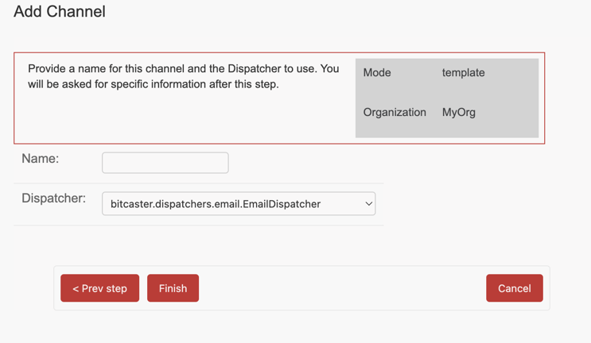
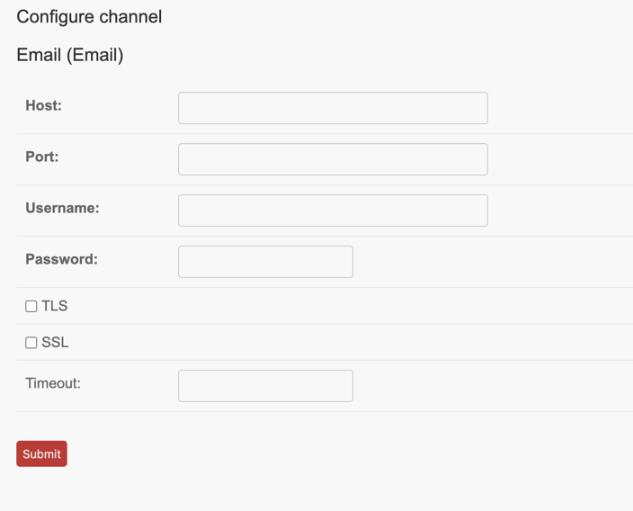

# Create Abstract Channel

A <glossary:Channel> is the delivery medium of Bitcaster: email, SMS, push,
chat and so on. An **Abstract Channel** is a reusable template of a channel —
the provider and its configuration (e.g. the SMTP server, the Slack token) —
defined once at the organization level and later enabled for as many projects
as needed. This way the provider settings live in a single place and projects
just pick the channel they want to use.

!!! note

    This is an optional step you can can create standard project channels later.
    @see <glossary:Channel> for further infos.

From the [Organization page](https://SERVER_ADDRESS/admin/bitcaster/organization/current/){:target=_bc} click on
[Create Channel](https://SERVER_ADDRESS/admin/bitcaster/organization/current/){ target='link' .bc-button .action }

1. Provide a name for your channel ad choose one of the available [dispatchers](dispatchers/index.md).
1. After you click `Finish`{.bc-button } you will be asked to provide Dispatcher specific configuration.

