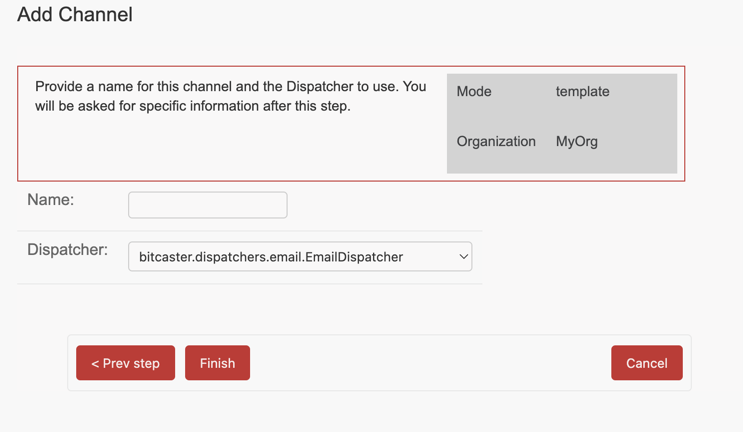
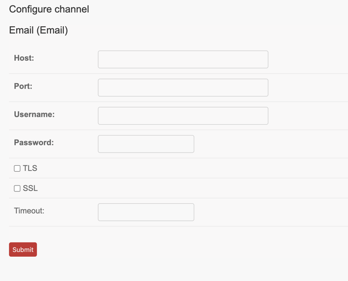

# Create Abstract Channel

!!! note

    This is an optional step you can can create standard project channels later.
    @see <glossary:Channel> for further infos.

From the [Organization page](https://SERVER_ADDRESS/admin/bitcaster/organization/current/){:target=_bc} click on 
[Create Channel](https://SERVER_ADDRESS/admin/bitcaster/organization/current/){ target='link' .bc-button .action }

1. Provide a name for your channel ad choose one of the available [dispatchers](dispatchers.md).
1. After you click `Finish`{.bc-button } you will be asked to provide Dispatcher specific configuration.

