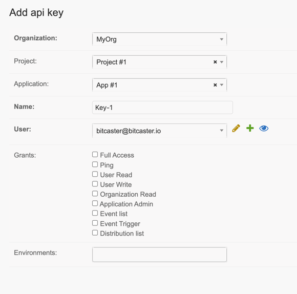

# Create API Key

To allow your <glossary:remote system> to trigger an event you must create an API Key

1. Go to [API Key section](https://SERVER_ADDRESS/admin/bitcaster/apikey/){:target=_bc}  click on 
`Add APi KEY`{ .bc-tool-button .action }
   

1. Fill the required fields and select the grants you want to provide to.
1. Click `Save`{class='bc-button' } 
1. Copy the displayed key 

!!! danger "Warning"

    The key is displayed only this time. It is not possible to read it again.
