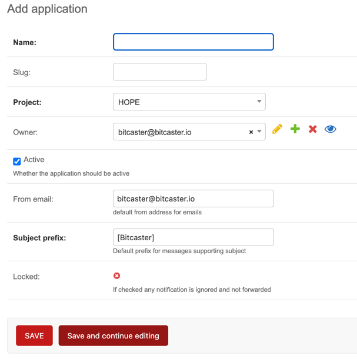

# Configure Application

Now that your Organization and Project have been configured, you can start adding all the Applications that you want to be served by Bitcaster.

Click on the `Add Application` button on the top right of the 
[Project page](https://SERVER_ADDRESS/admin/bitcaster/project/current/){:target=_bc}  

or navigate to <https://SERVER_ADDRESS/admin/bitcaster/application/add/>{: target='link' }

Now you are ready to [configure your Application](app.md) 
adding <glossary:Event>, <glossary:Notification> and <glossary:Distribution List>
