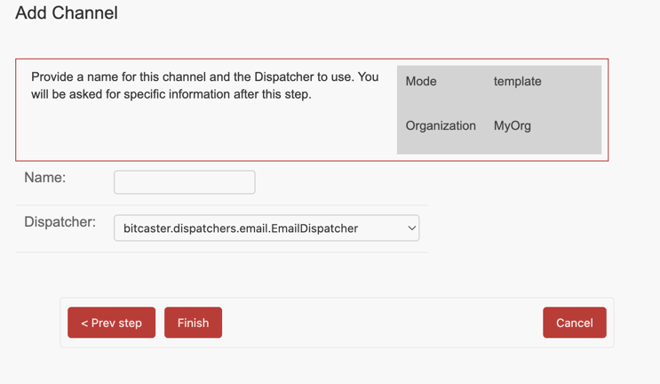
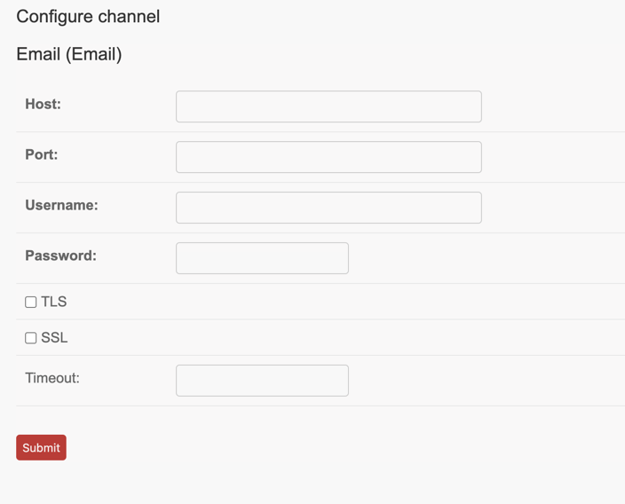

# Create Channel Template

From the [Organization page](https://SERVER_ADDRESS/admin/bitcaster/organization/current/){:target=_bc}  click on `Create Channel`

1. Provide a name for your channel ad choose one of the available [dispatchers](dispatchers.md).
1. After you click `Finish` you will be asked to provide Dispatcher specific configuration.

