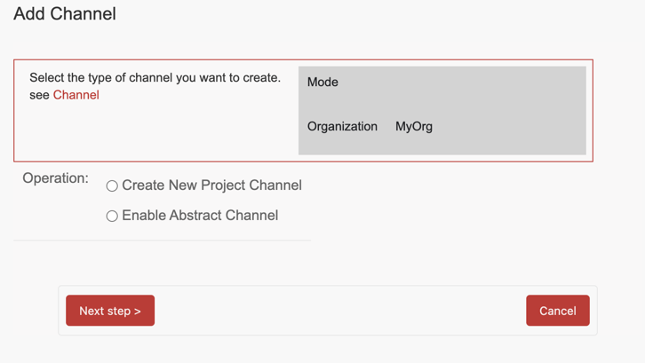
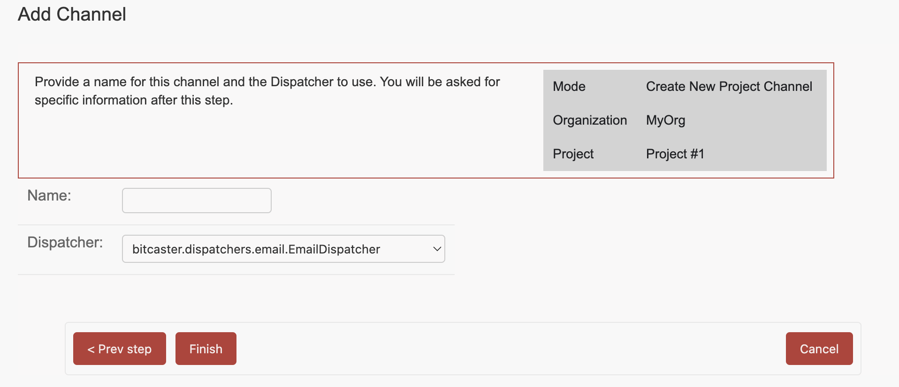
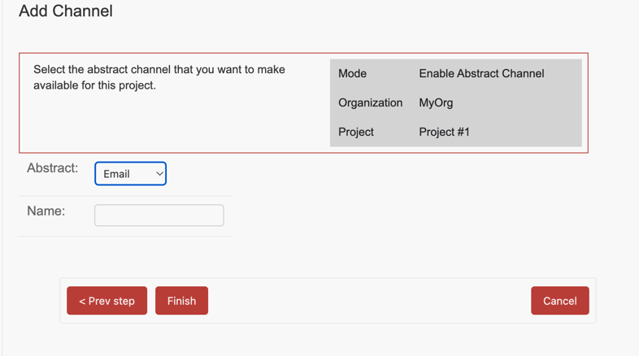

# Enable Project Channel

A **Project Channel** binds an abstract channel to a concrete sender for one
project: the email address the messages are sent from, the Slack workspace,
the phone number for SMS. It is what makes the project actually able to
deliver: notifications only reach recipients on channels that are enabled for
the project.

From the [Project page](https://SERVER_ADDRESS/admin/bitcaster/project/current/){:target=_bc}  click on
`Add Channel`{ .bc-tool-button .action }

Here you can enable an Organization's <glossary:Abstract Channel> or create a new <glossary:Project Channel> from scratch

## Create New Project Channel

## Enable Abstract Channel

If you have previously [created any Abstract Channel](abstract_channel_create.md) you can enable for the Project

