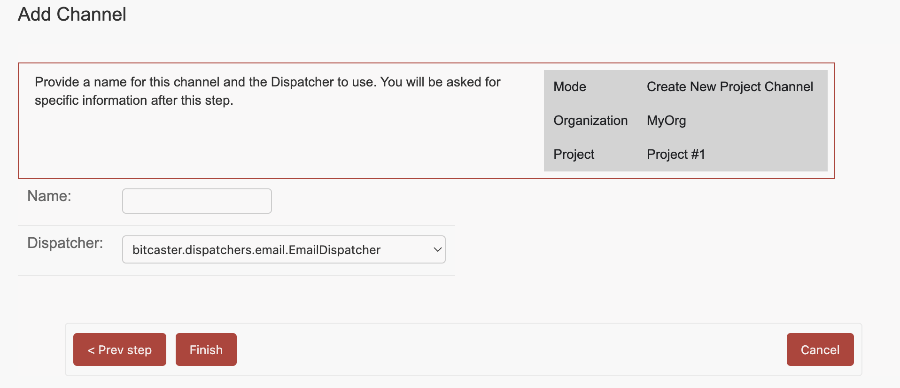

# Enable Project Channel

From the [Project page](https://SERVER_ADDRESS/admin/bitcaster/project/current/){:target=_bc}  click on 
`Add Channel`{ .bc-tool-button .action }

Here you can enable an Organization's <glossary:Abstract Channel> or create a new <glossary:Project Channel> from scratch

## Create New Project Channel

## Enable Abstract Channel

