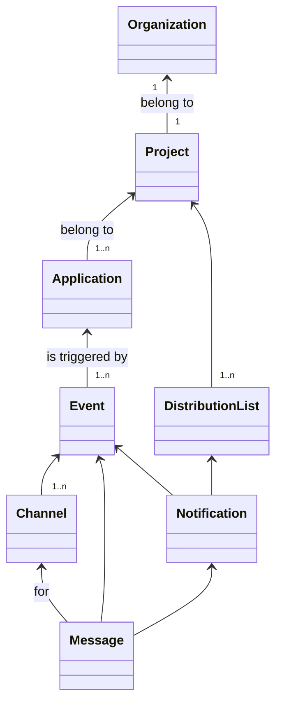

# Class

```mermaid

classDiagram
    Organization "1" <-- "1" Project:belong to
    Project <-- "1..n" Application:belong to
    Application <-- "1..n" Event:is triggered by
    Project <-- "1..n" DistributionList
    Event <-- "1..n" Channel
    
    Channel <-- Message:for
    Event <-- Message
    Notification <-- Message
    DistributionList <-- Notification
    Event <-- Notification

```
