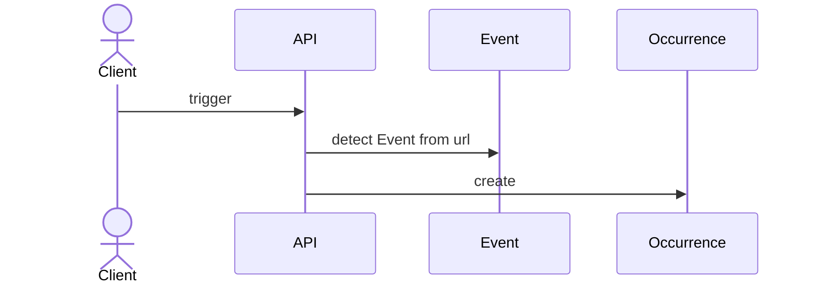
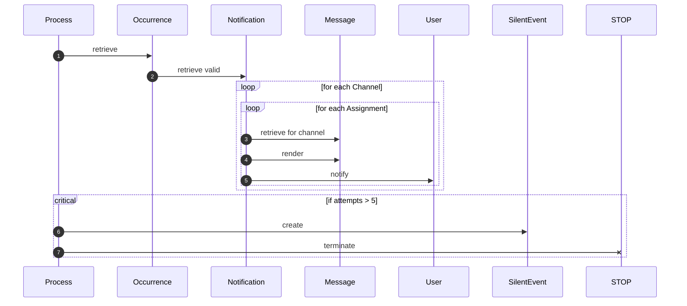

# Flow

### Trigger Event

```mermaid
sequenceDiagram
    
    actor Client
    Client->>API: trigger
    API ->> Event: detect Event from url
    API ->> Occurrence: create 
    
```

### Process Occurrence

```mermaid
sequenceDiagram
    autonumber
    Process ->> Occurrence: retrieve
    Occurrence ->> Notification: retrieve valid
    loop for each Channel 
        loop for each Assignment
            Notification ->> Message: retrieve for channel
            Notification ->> Message: render
            Notification ->> User: notify
        end
    end
    critical if attempts > 5
        Process ->> SilentEvent: create
        Process -x STOP: terminate
    end
```
