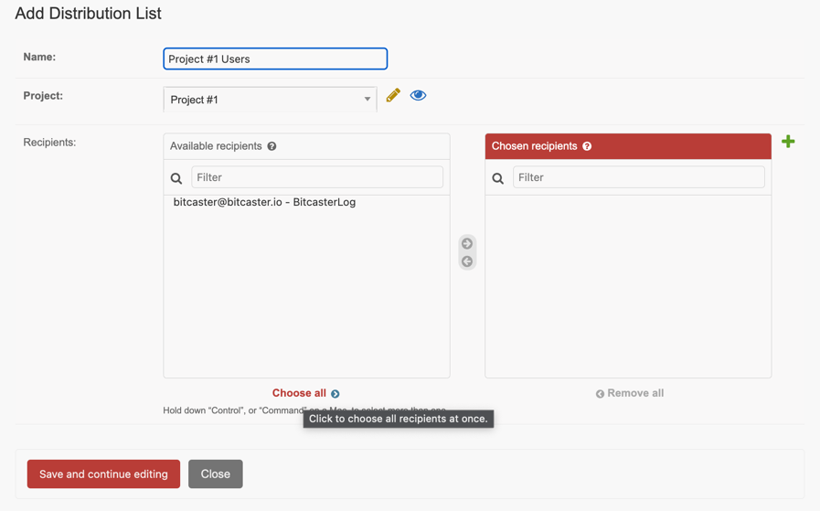

# Distribution Lists

## Overview

A **Distribution List** is a named group of recipients within a Project.
It serves as the target audience for [Notifications](notification.md) — when an
Event triggers a Notification, the recipients are resolved from the
Notification's assigned Distribution List.

A Distribution List belongs to a Project and contains zero or more recipients
(an Assignment representing a user's address on a specific Channel).

## Purpose

Distribution Lists decouple **who receives a notification** from **what event
triggers it**. Multiple Notifications can share the same Distribution List,
and the same user can belong to multiple Distribution Lists.

Typical use cases:

- **Team alerts**: a Distribution List named "on-call-engineers" receives
  infrastructure alerts.
- **Customer communications**: a Distribution List named "active-users" receives
  product updates.
- **Cross-project lists**: a Distribution List can aggregate users from
  different Channels (email, Slack, SMS) into a single target.

## Link with Notifications

A [Notification](notification.md) is the rule that connects an Event to a
Distribution List. The flow is:

```
  Event Trigger → Occurrence → Notification → Distribution List → Recipients (Assignments)
```

- The **Event** defines **what** happened.
- The **Notification** defines **who** should know (via its Distribution List)
  and **how** (via Channels and Message Templates).
- The **Distribution List** defines the actual recipients.

Notifications with policy `FILTERING_NONE` (the default) require a
Distribution List. Other policies (`DYNAMIC`, `EXTERNAL`) select recipients
without using a Distribution List.

## Pinned Distribution List

A Distribution List can be optionally pinned to an Application by setting the
**Application** field. When pinned, each recipient in the list represents a user
in that application. This is useful in distributed environments where users are
managed externally.

### Motivation

In a distributed setup, users may exist across multiple applications, or some
applications (e.g. shell scripts) may have no users at all. A user can be added
to a Distribution List for an Event triggered by an Application that does not
own that user.

However, when a user is removed from an Application, they should stop receiving
notifications from Events triggered by that Application. Pinning a
Distribution List to an Application solves this: the remote application calls
the `unregister` endpoint, and Bitcaster automatically removes the user from
all Distribution Lists pinned to that application.

### Behaviour

- **Pinned** (`application` is set): the Distribution List only works with
  Notifications whose Event belongs to the same Application. Creating or
  updating a Notification with a mismatched Application raises a validation
  error.
- **Non-pinned** (`application` is null): the Distribution List works as
  before with any Notification in the same Project.

### API Reference

- `POST /api/o/{org}/p/{prj}/a/{app}/unregister/{username}/` — Removes a user
  from all Distribution Lists pinned to the application. Requires the new
  `MANAGE_APPLICATION_USERS` grant.

## Creating a Distribution List

From the [Project page](https://SERVER_ADDRESS/admin/bitcaster/project/current/){:target=_bc}
click on `Add Distribution List`{ .bc-tool-button .action }



Enter a name and optionally pin it to an Application. After saving, you can add
recipients via the `Recipients` button.
