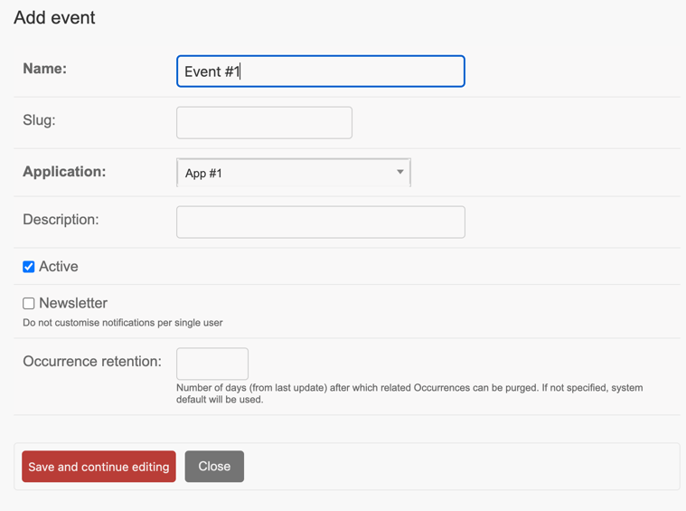
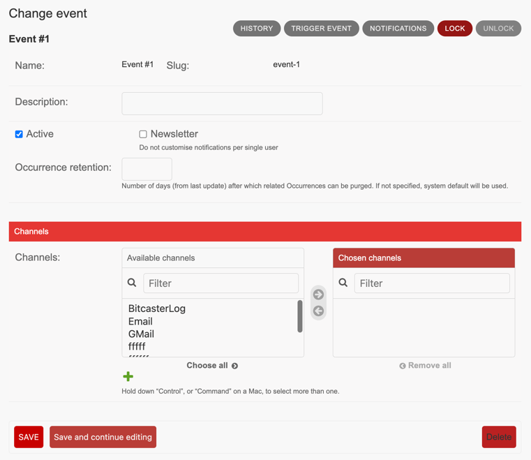

# Register Application Events

To allow Bitcaster to process [events][event], those need to be listed and configured.

## Create Event

After the Event has been successfully created, you can choose which <glossary:Channel>s 
you want make available for this 

## Enable Channels

Setup which channels can be used to notify this event

