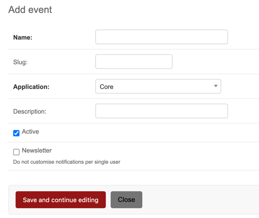

# Register Application Events

To allow Bitcaster to process [events][event], those need to be listed and configured.

After the Event has been successfully created, you can choose which <glossary:Channel>s 
you want make available for this 

