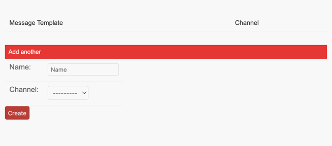

# Create Messages

Select the notification you want to configure from [Notification list page](<https://SERVER_ADDRESS/admin/bitcaster/notification/>){ target=_app } and click on `messages`{ .bc-tool-button .link }

Select on of the channels available for the Notification's event ad click on `Create`{ .bc-button }
