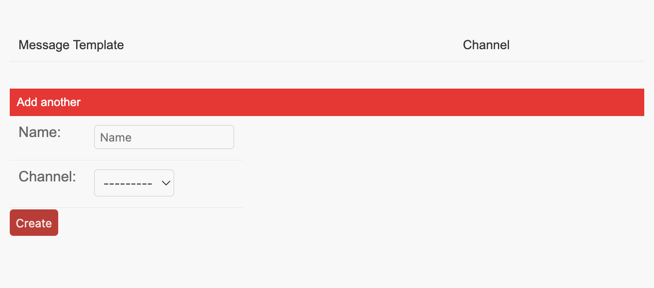

# Create Messages

A **Message** is the content the recipients see: the subject and the body
(plain text and HTML) of a notification, rendered for one specific
<glossary:Channel>. Each channel enabled for the event needs its own message,
so an email message can be worded differently from a Slack one. The rendered
content is snapshotted when a delivery is created, so editing a message later
never changes messages that are already queued.

Select the notification you want to configure from [Notification list page](<https://SERVER_ADDRESS/admin/bitcaster/notification/>){ target=_app } and click on `messages`{ .bc-tool-button .link }

Select on of the channels available for the Notification's event ad click on `Create`{ .bc-button }
