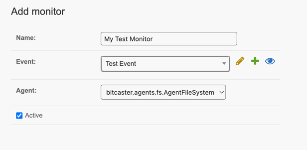
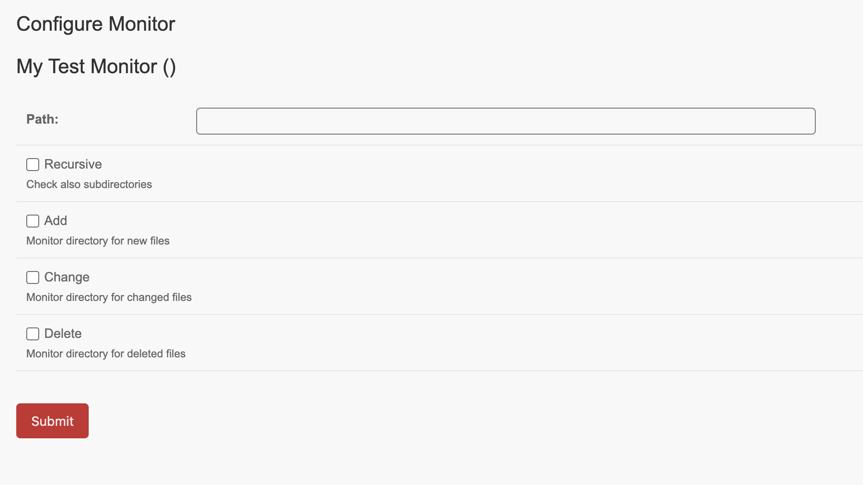
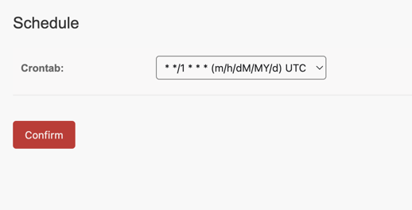
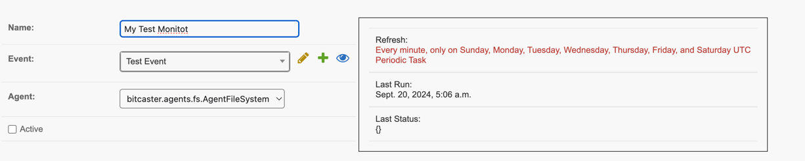

---
tags:
   - Monitor

---
# Configure Monitors

Monitors allow you to "trigger" an application event based on an external event.

Each monitor must use an <glossary:Agent> to check for changes.

## How to add a Monitor:

1. Go to <https://SERVER_ADDRESS/admin/bitcaster/monitor/> and click `Add Monitor`{class='bc-tool-button' }

     

1. Provide a name, select your event and the Agent and click `Save`{class='bc-button' }

1. Configure your Agent

      

1. Configure Agent scheduling

     
   
     Scheduler uses crontab synthax where wa

2. Review your settings

     
