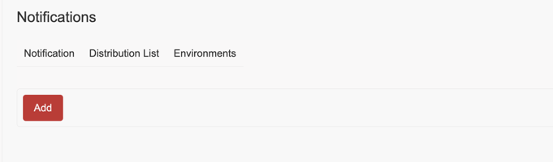
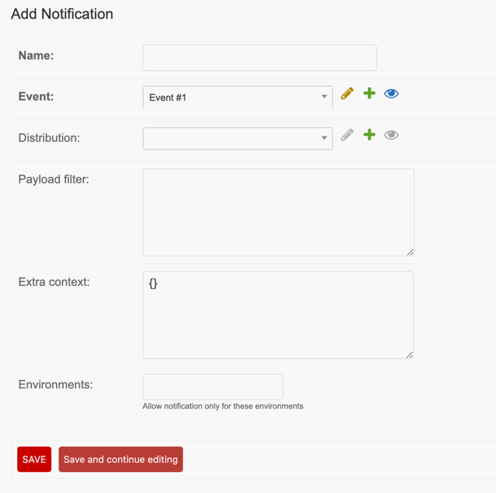

# Create Notification Rule

1. Select the event you want to configure in your [Events list page](<https://SERVER_ADDRESS/admin/bitcaster/event/>)
2. From the Event's detail page, click the `Notifications`{ .bc-tool-button .link } button

3. Click on `Add`

Provide a name for this Notification, and the <glossary:Distribution List> 
that should receive the information and click on `Save and Continue`{ .bc-button } 

Now that your Notification is ready you can click on the `Messages`{ .bc-tool-button .link } 
to [create notification message](message.md)

## Setup Notification Filters

TODO

## Add Extra context

TODO
