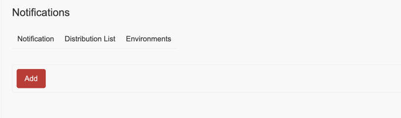
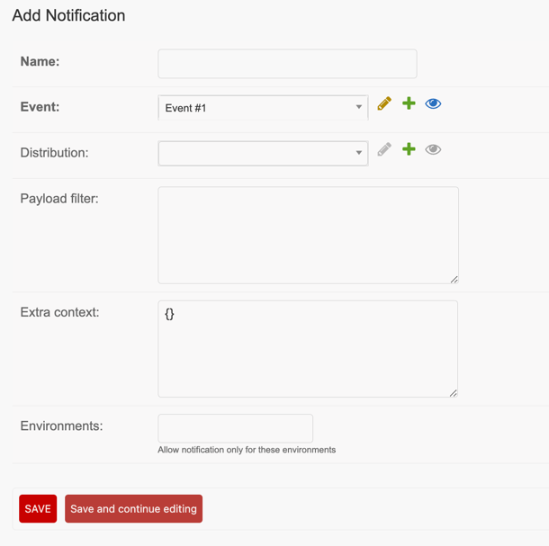

# Notifications

## Concept

A Notification is the rule that connects an **Event** to a
**Distribution List**. When an Event is triggered, the system looks up all
active Notifications for that Event, resolves the recipients from each
Notification's Distribution List, and delivers the message via the configured
Channels.

The flow is:

```
Event Trigger → Occurrence → Notification → Distribution List → Recipients
```

The [Distribution List](dl.md) defines **who** receives the notification. The
Notification itself defines **when** (which Event), **how** (which Channel and
Message Templates), and optional **filters** (payload filtering, dynamic
recipient selection).

## Create Notification Rule

1. Select the event you want to configure in your [Events list page](<https://SERVER_ADDRESS/admin/bitcaster/event/>)
2. From the Event's detail page, click the `Notifications`{ .bc-tool-button .link } button



3. Click on `Add`




Provide a name for this Notification, and the <glossary:Distribution List>
that should receive the information and click on `Save and Continue`{ .bc-button }

!!! info "Pinned Distribution Lists"
    If the selected Distribution List is pinned to an Application, the Event's
    Application must match. Otherwise, the form will display a validation error.

Now that your Notification is ready you can click on the `Messages`{ .bc-tool-button .link }
to [create notification message](message.md)

## Setup Notification Filters

TODO


## Add Extra context

TODO
