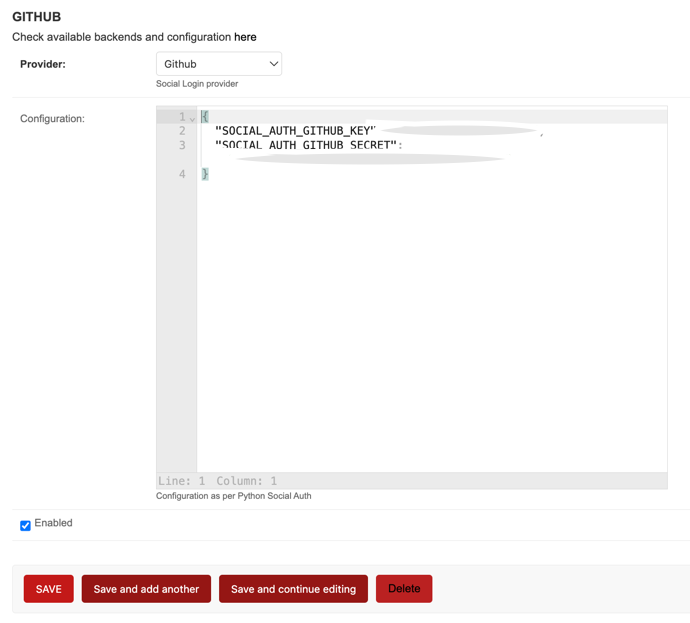
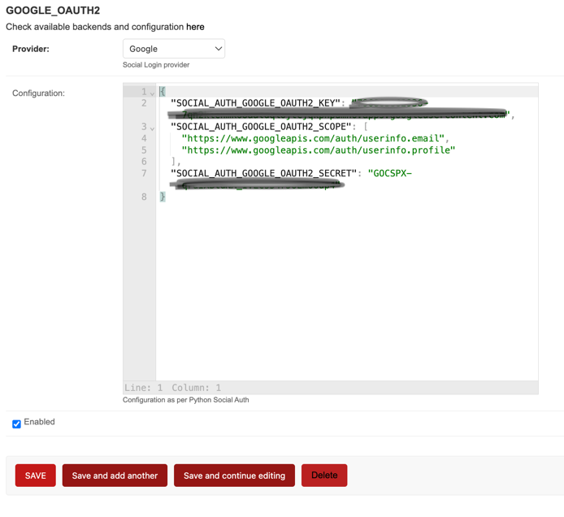

---
tags:
   - SSO
---

# Social Login

Social Login can be configured at <https://SERVER_ADDRESS/admin/social/socialprovider/>

1. Navigate to <https://SERVER_ADDRESS/admin/social/socialprovider/add/>
2. Select one of the supported provider and add related configuration as
   a JSON object in the **Configuration** field.
3. Be sure `enabled` is checked before saving the form.

The configuration uses the [Python Social Auth](https://python-social-auth.readthedocs.io/) settings.
In Bitcaster, these settings must be provided as a JSON dictionary where keys are the setting names
(e.g., `SOCIAL_AUTH_GITHUB_KEY`).

## Supported backends

### Azure AD

To use Azure AD, you need to register an application in the Azure Portal.

!!! example "Configuration"
    ```json
    {
      "SOCIAL_AUTH_AZUREAD_OAUTH2_KEY": "<your-client-id>",
      "SOCIAL_AUTH_AZUREAD_OAUTH2_SECRET": "<your-client-secret>"
    }
    ```

#### Tenant support
If you want to restrict login to a specific tenant:

!!! example "Configuration"
    ```json
    {
      "SOCIAL_AUTH_AZUREAD_TENANT_OAUTH2_KEY": "<your-client-id>",
      "SOCIAL_AUTH_AZUREAD_TENANT_OAUTH2_SECRET": "<your-client-secret>",
      "SOCIAL_AUTH_AZUREAD_TENANT_OAUTH2_TENANT_ID": "<your-tenant-id>"
    }
    ```

Further reading: [Azure AD Auth](https://python-social-auth.readthedocs.io/en/latest/backends/azuread.html#microsoft-azure-active-directory)

### Facebook

Requires a Facebook App.

!!! example "Configuration"
    ```json
    {
      "SOCIAL_AUTH_FACEBOOK_KEY": "<your-app-id>",
      "SOCIAL_AUTH_FACEBOOK_SECRET": "<your-app-secret>",
      "SOCIAL_AUTH_FACEBOOK_SCOPE": ["email"]
    }
    ```

Further reading: [Facebook Auth](https://python-social-auth.readthedocs.io/en/latest/backends/facebook.html#oauth2)

### GitLab

Requires a GitLab Application.

!!! example "Configuration"
    ```json
    {
      "SOCIAL_AUTH_GITLAB_KEY": "<your-application-id>",
      "SOCIAL_AUTH_GITLAB_SECRET": "<your-secret>",
      "SOCIAL_AUTH_GITLAB_API_URL": "https://gitlab.com"
    }
    ```

Further reading: [GitLab Auth](https://python-social-auth.readthedocs.io/en/latest/backends/gitlab.html)

### GitHub

Requires a GitHub OAuth App.

!!! example "Configuration"
    ```json
    {
      "SOCIAL_AUTH_GITHUB_KEY": "<your-client-id>",
      "SOCIAL_AUTH_GITHUB_SECRET": "<your-client-secret>",
      "SOCIAL_AUTH_GITHUB_SCOPE": ["user:email"]
    }
    ```

#### GitHub Enterprise

!!! example "Configuration"
    ```json
    {
      "SOCIAL_AUTH_GITHUB_ENTERPRISE_KEY": "<your-client-id>",
      "SOCIAL_AUTH_GITHUB_ENTERPRISE_SECRET": "<your-client-secret>",
      "SOCIAL_AUTH_GITHUB_ENTERPRISE_URL": "https://github.example.com",
      "SOCIAL_AUTH_GITHUB_ENTERPRISE_API_URL": "https://github.example.com/api/v3"
    }
    ```

#### GitHub Organizations
Restricts login to members of specific organizations.

!!! example "Configuration"
    ```json
    {
      "SOCIAL_AUTH_GITHUB_ORG_KEY": "<your-client-id>",
      "SOCIAL_AUTH_GITHUB_ORG_SECRET": "<your-client-secret>",
      "SOCIAL_AUTH_GITHUB_ORG_NAME": "<your-org-name>"
    }
    ```

#### GitHub Team
Restricts login to members of a specific team.

!!! example "Configuration"
    ```json
    {
      "SOCIAL_AUTH_GITHUB_TEAM_KEY": "<your-client-id>",
      "SOCIAL_AUTH_GITHUB_TEAM_SECRET": "<your-client-secret>",
      "SOCIAL_AUTH_GITHUB_TEAM_ID": "<your-team-id>"
    }
    ```



Further reading: [GitHub Auth](https://python-social-auth.readthedocs.io/en/latest/backends/github.html)

### Google

Requires a Google Cloud Project with OAuth 2.0 Client ID.

!!! example "Configuration"
    ```json
    {
      "SOCIAL_AUTH_GOOGLE_OAUTH2_KEY": "<your-client-id>",
      "SOCIAL_AUTH_GOOGLE_OAUTH2_SECRET": "<your-client-secret>"
    }
    ```

Sample Configuration:



Further reading: [Google Auth](https://python-social-auth.readthedocs.io/en/latest/backends/google.html#google-oauth2)

### LinkedIn

!!! example "Configuration"
    ```json
    {
      "SOCIAL_AUTH_LINKEDIN_OAUTH2_KEY": "<your-client-id>",
      "SOCIAL_AUTH_LINKEDIN_OAUTH2_SECRET": "<your-client-secret>",
      "SOCIAL_AUTH_LINKEDIN_OAUTH2_SCOPE": ["r_liteprofile", "r_emailaddress"]
    }
    ```

Further reading: [LinkedIn Auth](https://python-social-auth.readthedocs.io/en/latest/backends/linkedin.html#linkedin-oauth2)

### Keycloak

!!! example "Configuration"
    ```json
    {
      "SOCIAL_AUTH_KEYCLOAK_KEY": "<your-client-id>",
      "SOCIAL_AUTH_KEYCLOAK_SECRET": "<your-client-secret>",
      "SOCIAL_AUTH_KEYCLOAK_PUBLIC_KEY": "<your-public-key>",
      "SOCIAL_AUTH_KEYCLOAK_AUTHORIZATION_URL": "https://<key-url>/auth/realms/<realm>/protocol/openid-connect/auth",
      "SOCIAL_AUTH_KEYCLOAK_ACCESS_TOKEN_URL": "https://<key-url>/auth/realms/<realm>/protocol/openid-connect/token"
    }
    ```

Further reading: [Keycloak Auth](https://python-social-auth.readthedocs.io/en/latest/backends/keycloak.html)

### WSO2

Uses a specialized backend that requires OpenID Connect configuration.

!!! example "Configuration"
    ```json
    {
      "SOCIAL_AUTH_OAUTH2_KEY": "<your-client-id>",
      "SOCIAL_AUTH_OAUTH2_SECRET": "<your-client-secret>",
      "SOCIAL_AUTH_OAUTH2_AUTHORIZATION_URL": "https://<wso2-url>/oauth2/authorize",
      "SOCIAL_AUTH_OAUTH2_ACCESS_TOKEN_URL": "https://<wso2-url>/oauth2/token",
      "SOCIAL_AUTH_OAUTH2_USERINFO_URL": "https://<wso2-url>/oauth2/userinfo"
    }
    ```

Further reading: [WSO2 Auth](https://python-social-auth.readthedocs.io/en/latest/backends/wso2.html)

### Twitter

Requires a Twitter Developer App.

!!! example "Configuration"
    ```json
    {
      "SOCIAL_AUTH_TWITTER_KEY": "<your-consumer-key>",
      "SOCIAL_AUTH_TWITTER_SECRET": "<your-consumer-secret>"
    }
    ```

Further reading: [Twitter Auth](https://python-social-auth.readthedocs.io/en/latest/backends/twitter_oauth2.html)

### Generic OAuth

Can be used for any OAuth2 compatible provider.

!!! example "Configuration"
    ```json
    {
      "SOCIAL_AUTH_OAUTH2_KEY": "<your-client-id>",
      "SOCIAL_AUTH_OAUTH2_SECRET": "<your-client-secret>",
      "SOCIAL_AUTH_OAUTH2_AUTHORIZATION_URL": "https://example.com/authorize",
      "SOCIAL_AUTH_OAUTH2_ACCESS_TOKEN_URL": "https://example.com/token"
    }
    ```

Further reading: [Generic OAuth2](https://python-social-auth.readthedocs.io/en/latest/backends/oauth.html#oauth2)

## Global configuration

Some global parameters for Social Auth can be configured in the Bitcaster Admin interface at <https://SERVER_ADDRESS/admin/constance/config/>

| Parameter | Default | Description |
| --- | --- | --- |
| `SOCIAL_AUTH_CREATE_USER` | `True` | If true, not existing users will be automatically created. If false, only already existing users can log in via SSO. |
| `SOCIAL_AUTH_ACCEPTED_USERS` | `""` | A comma separated list of emails that are allowed to log in. It supports regular expressions (e.g., `.*@example.com`). |
| `NEW_USER_DEFAULT_GROUP` | `DEFAULT_GROUP_NAME` | The Django Group that will be assigned to any new user created via SSO. |
| `NEW_USER_IS_STAFF` | `False` | If true, any new user created (via SSO or otherwise) will be marked as staff. |
