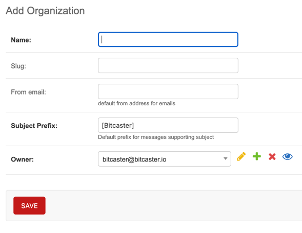
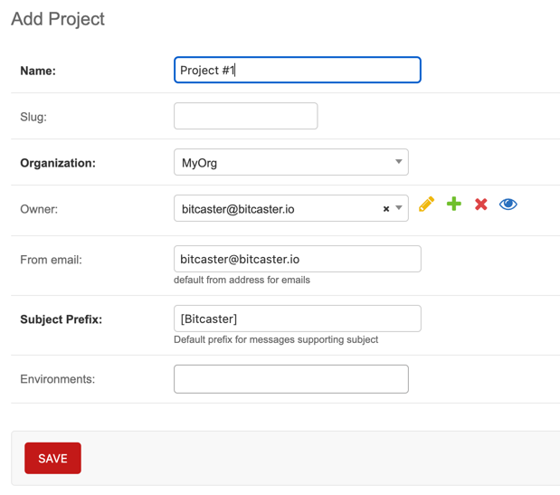

Before we can start triggering events in Bitcaster we need to create the initial structure

Navigate to <https://SERVER_ADDRESS/admin/bitcaster/organization/current/>{: target='_app' } to add your <glossary:Organization>.

!!! note

    you will find an already created OS4D Organization, you cannot edit or delete it. 
    It is used by Bitcaster.

Now you can create your first Project.  

Click on the 
[Project](https://SERVER_ADDRESS/admin/bitcaster/organization/current/){ target='_app' .bc-button .object-tools }
 button on the top right corner or your [Project's page](https://SERVER_ADDRESS/admin/bitcaster/organization/current/)

!!! warning

    Depepnding on your license you could be limited to only one Project per installation. 

