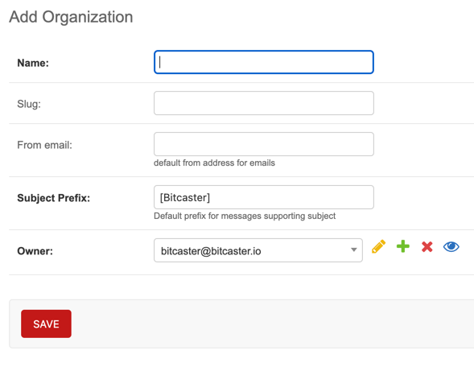
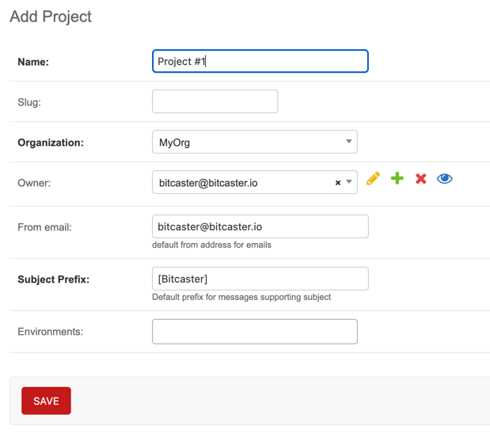

# Create the Initial Structure

Bitcaster organises everything in a three-level hierarchy: an
<glossary:Organization> is the top-level tenant (usually the company), a
<glossary:Project> groups the applications of a business unit, product line or
team, and an <glossary:Application> (see [Add Application](app.md)) hosts the
events, notifications and channels of one product. Organization-wide settings
and abstract channels live at the top, while projects scope their own
channels, distribution lists and members.

Before we can start triggering events in Bitcaster we need to create the initial structure

Navigate to <https://SERVER_ADDRESS/admin/bitcaster/organization/current/>{: target='_app' } to add your <glossary:Organization>.

!!! note

    you will find an already created OS4D Organization, you cannot edit or delete it.
    It is used by Bitcaster.

Now you can create your first Project.

Click on the
[Project](https://SERVER_ADDRESS/admin/bitcaster/organization/current/){ target='_app' .bc-button .object-tools }
 button on the top right corner or your [Project's page](https://SERVER_ADDRESS/admin/bitcaster/organization/current/)

!!! warning

    Depending on your license you could be limited to only one Project per installation.

