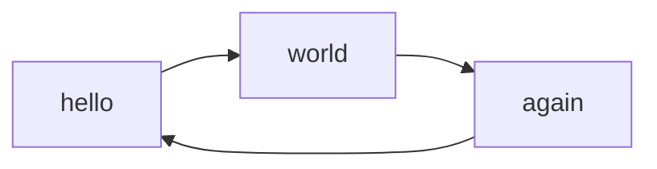
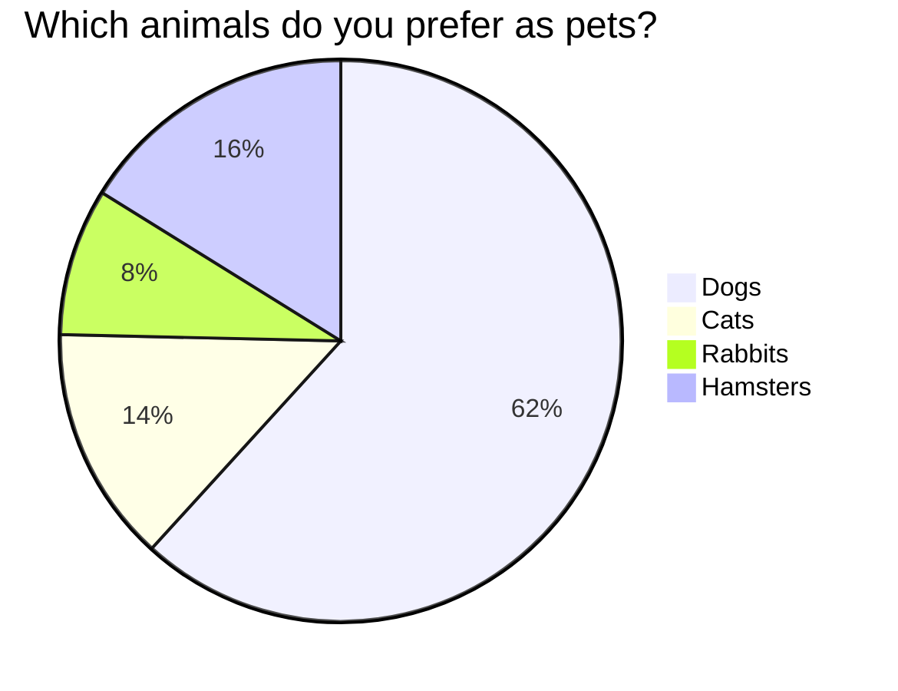

# Mermaid

Ref: [mkdocs-mermaid2-plugin](https://github.com/fralau/mkdocs-mermaid2-plugin)





# Superfences

Ref: [superfences](https://facelessuser.github.io/pymdown-extensions/extensions/superfences/)

> ```
  a fenced block

> with blank lines
  ```
  
- &#32;
    ```
    a fenced block
    ```

Definition
: &#32;
    ```
    a fenced block
    ```